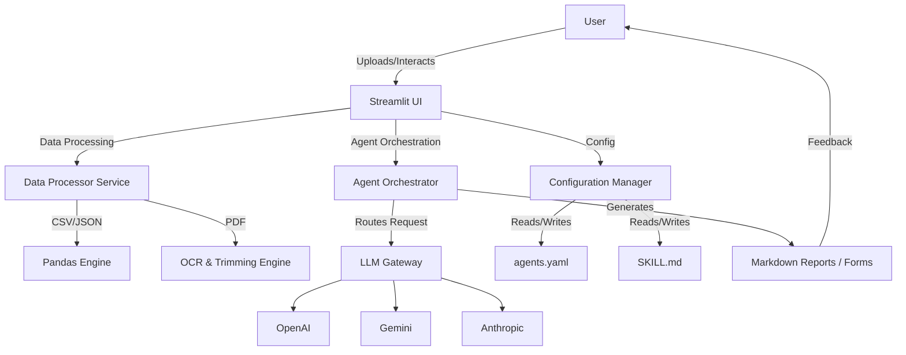

# Technical Specification: Advanced Medical Device Application & Agentic Review System

## 1. Executive Summary

### 1.1 Project Overview
This document outlines the technical specifications for an advanced **Medical Device Application & Agentic Review System**. The system is designed to streamline the regulatory submission and review process for medical devices (specifically focusing on FDA 510(k) and TFDA Class II/III applications). By leveraging Generative AI and Agentic Workflows, the system automates the generation of application forms from raw datasets, facilitates the management of review guidance, and executes comprehensive compliance reviews using customizable AI agents.

The core philosophy of the system is "Human-in-the-Loop AI," where users retain full control over data, prompts, and models while the AI handles the heavy lifting of data formatting, document synthesis, and regulatory cross-referencing.

### 1.2 Key Objectives
*   **Automate Application Form Creation**: Transform raw CSV/JSON datasets into structured Markdown application forms containing 20+ key regulatory entities.
*   **Intelligent Review Guidance**: Enable users to upload and process regulatory guidance (PDF/Text/MD), employing OCR and layout analysis to create structured, keyword-highlighted references.
*   **Agentic Compliance Review**: Deploy specialized AI agents to cross-reference application forms against review guidance, generating detailed compliance summaries and identifying gaps.
*   **Dynamic Configuration**: Provide effortless management of agent behaviors (`agents.yaml`) and system instructions (`SKILL.md`) directly through the UI.
*   **Premium User Experience**: Deliver a "WOW" level interface with highly responsive, aesthetically pleasing visual themes (Painter Styles) and intuitive workflows.

---

## 2. System Architecture

### 2.1 Technology Stack
The system is built on a robust, lightweight, and deployable stack optimized for Hugging Face Spaces.

*   **Frontend/Application Context**: **Streamlit** (Python). Streamlit is chosen for its rapid development capabilities and native support for data visualization, making it ideal for interactive AI tools.
*   **Language Models**: Integration with multiple providers via API:
    *   **OpenAI**: GPT-4o, GPT-4o-mini (Primary reasoning engines).
    *   **Google Gemini**: Gemini 1.5 Pro, Gemini 2.5 Flash (High-context window operations).
    *   **Anthropic**: Claude 3.5 Sonnet (Nuanced regulatory interpretation).
*   **Data Processing**:
    *   **Pandas**: For CSV/JSON dataset manipulation.
    *   **PyPDF / PDFPlumber**: For PDF text extraction and layout analysis.
    *   **Python-docx**: For Word document interoperability.
*   **Configuration Management**: YAML for agent definitions; Markdown for system skills.
*   **Deployment Environment**: Hugging Face Spaces (Dockerized or standard Python runtime).

### 2.2 High-Level Architecture Diagram


---

## 3. Functional Requirements

### 3.1 Module 1: Application Dataset Management
This module handles the ingestion and manipulation of raw product data.

#### 3.1.1 Dataset Upload & Ingestion
*   **Supported Formats**: The system MUST accept `.csv` and `.json` files.
*   **Validation**: Upon upload, the system analyzes the schema. If the schema matches known medical device data structures (e.g., UDI, GUDID formats), it automatically maps fields.
*   **Preview Interface**: Users can view the raw data in an interactive table (ag-grid or Streamlit dataframe) to verify correctness before processing.

#### 3.1.2 Data Modification
*   **Inline Editing**: Users can directly edit cell values within the data preview table.
*   **Download Capability**: Modified datasets can be downloaded back to the user's local machine in CSV or JSON format, preserving any changes made in the session.

### 3.2 Module 2: Automated Application Form Generation
This is the core generative engine that converts raw data into a regulatory document.

#### 3.2.1 Entity Extraction & Formatting
*   **Target Output**: A structured **Application Form** in Markdown format.
*   **Entity Requirement**: The system MUST generate a table containing exactly **20 specific regulatory entities**. These entities include but are not limited to:
    1.  Device Trade Name
    2.  Common Name
    3.  Classification Name
    4.  Product Code
    5.  Regulation Number
    6.  Device Class (I, II, III)
    7.  Review Panel
    8.  Indications for Use
    9.  Intended Use
    10. Prescription vs. OTC Status
    11. Sterile Status (Yes/No & Method)
    12. Single-use vs. Reusable
    13. Patient Contact Duration
    14. Patient Contact Nature
    15. Software Level of Concern
    16. Biocompatibility Standards
    17. Electrical Safety Standards
    18. EMC Standards
    19. Sterilization Standards
    20. Packaging Standards
*   **Context Generation**: Below the entity table, the system generates a "Context" section summarising the device description and mechanism of action based on the dataset.

#### 3.2.2 Dual-View Editor
*   **Markdown View**: Displays the raw markdown code for advanced users to copy or edit syntax directly.
*   **Text/Rich View**: Renders the markdown into a readable, formatted document.
*   **Synchronization**: Changes in the Markdown view immediately reflect in the Text view and vice-versa (where technically feasible, or via a "Apply Changes" button).

### 3.3 Module 3: Review Guidance Management
Users must be able to instruct the AI on *how* to review the application.

#### 3.3.1 Guidance Ingestion
*   **File Support**: `.txt`, `.md`, and `.pdf`.
*   **PDF Previewer**: An embedded PDF viewer (using iframe or base64 rendering) allows users to see the original document side-by-side with the processing tools.

#### 3.3.2 Intelligent PDF Processing (Trimming & OCR)
*   **Page Trimming**: Users can specify a range of pages (e.g., "Pages 1-5, 10-12") to focus the AI's attention on relevant sections (like the Executive Summary or specific Checklist chapters), ignoring irrelevant front matter.
*   **OCR & Text Extraction**:
    *   **Python Native**: Uses `pypdf` for fast extraction of digital-native PDFs.
    *   **LLM-Vision OCR**: For scanned documents or complex layouts, users can toggle "LLM OCR" which sends page images to a vision-capable model (GPT-4o or Gemini 1.5 Pro) for high-fidelity text reconstruction.
*   **Reorganization**: The extracted text is automatically restructured into clean Markdown.
*   **Coral Keyword Highlighting**: The system analyzes the text and wraps key regulatory terms (e.g., "MUST", "SHALL", "Predicate Device", "510(k)") in HTML spans with `style="color: coral;"`. This visual aid helps users quickly visually scan the digitized guidance.

#### 3.3.3 Guidance Modification
*   Users can edit the resulting Markdown guidance document to correct OCR errors or add specific emphasis before passing it to the review agent.
*   **Persistence**: Modified guidance can be downloaded as `.md`.

### 3.4 Module 4: Agentic Review Execution
The system orchestrates an AI agent to perform the actual compliance review.

#### 3.4.1 Analysis Engine
*   **Inputs**:
    1.  The **Application Form** (generated in Module 2).
    2.  The **Review Guidance** (processed in Module 3).
*   **Process**: The Agent reads the Application Form and cross-references every entity and claim against the logic/rules defined in the Review Guidance.

#### 3.4.2 User Control (Human-in-the-Loop)
*   **Model Selection**: Users can choose the specific model for the review (e.g., "gemini-1.5-pro" for long context, "gpt-4o" for complex reasoning).
*   **Prompt Customization**: The system provides a default "Reviewer Prompt" (defined in `agents.yaml`), but enables the user to edit this prompt in a text area before execution. This allows for ad-hoc focus (e.g., "Focus specifically on Biocompatibility gaps").

#### 3.4.3 Review Summary Output
*   **Format**: A unified Markdown document.
*   **Content**:
    *   **Executive Summary of Findings**.
    *   **Compliance Matrix**: A table mapping Application Entities to Guidance Requirements with status (Pass/Fail/Clarification Needed).
    *   **Risk Analysis**: Potential regulatory hurdles identified.
    *   **Action Items**: Specific recommendations for the user.

### 3.5 Module 5: Interactive Review Report (Chat)
*   **Contextual Chat**: After the review report is generated, the system creates a chat session initialized with the Report, the Application Form, and the Guidance.
*   **Prompt Retention**: The chat interface identifies and "keeps" the system prompt used for generation, ensuring the chatbot maintains the persona of the reviewer.
*   **Iterative Refinement**: Users can ask "Why did you flag the sterilization section?" or "Help me rewrite the Intended Use to comply," and the agent will respond based on the loaded context.

### 3.6 Module 6: System Configuration (Agents & Skills)
To ensure the system is extensible and standardized, users can manage the core configuration files.

#### 3.6.1 Agents.yaml Management
*   **View & Edit**: A dedicated tab displays the raw YAML content of `agents.yaml`.
*   **Upload/Download**: Users can upload a custom `yaml` file to overwrite current settings or download the current config.
*   **Auto-Standardization**:
    *   If a user uploads a non-compliant YAML (missing keys, wrong structure), the system activates a background "Config Standardizer" agent.
    *   This agent parses the invalid YAML and restructures it into the strict schema required by the app (ensuring keys like `name`, `model`, `temperature`, `system_prompt` exist).
    *   The standardized YAML is then presented to the user for confirmation.

#### 3.6.2 SKILL.md Management
*   Similar to `agents.yaml`, the `SKILL.md` (System Instructions / Knowledge Base) can be viewed, edited, uploaded, and downloaded. This allows teams to share "Knowledge bases" or "Instruction sets" for different device types.

---

## 4. UI/UX Design Specifications

### 4.1 Aesthetic Philosophy
The design must adhere to the "WOW" principle:
*   **Color Palette**: Neural, sophisticated dark modes with vibrant accent colors (Coral, Teal, Indigo) used for status indicators and keywords.
*   **Painter Styles**: The "Jackpot" feature from the previous app is retained and expanded. Backgrounds and color themes abstractly reference styles of Van Gogh, Monet, etc., using CSS gradients and glassmorphism cards.
*   **Typography**: Clean sans-serif fonts (Inter or Roboto) for UI elements; Monospace (JetBrains Mono) for editors.

### 4.2 Layout Structure
*   **Sidebar**: Global settings (API Keys, Theme, Model Selection, File Downloads).
*   **Main Navigation**: Tab-based navigation for workflow phases:
    1.  **Dashboard**: System status and recent history.
    2.  **Data Studio**: Dataset upload and Form generation.
    3.  **Guidance Lab**: PDF processing and Guidance editing.
    4.  **Review Cockpit**: Agent configuration and Analysis execution.
    5.  **Report Viewer**: Interactive chat and report export.
    6.  **Config Manager**: `agents.yaml` and `SKILL.md` controls.

---

## 5. Security and Deployment

### 5.1 API Key Management
*   **Environment Variables**: The system prioritizes `OPENAI_API_KEY`, `GEMINI_API_KEY`, etc., stored in the deployment environment secrets.
*   **UI Input**: If environment variables are missing, the Sidebar prompts the user to enter keys.
*   **Privacy**: Keys entered in the UI are processed only in memory for the duration of the session and are masked in the UI. They are never logged to console or saved to disk.

### 5.2 Hugging Face Space Configuration
*   **SDK**: Streamlit.
*   **Dependencies**: `requirements.txt` must include `streamlit`, `pandas`, `pypdf`, `openai`, `google-generativeai`, `anthropic`, `pyyaml`.
*   **Performance**: Recommended Hardware: CPU Basic (2 vCPU, 16GB RAM) is sufficient as heavy lifting is done via API calls.

---

## 6. Implementation Stages & Roadmap

### Phase 1: Core Framework & Data Ingestion
*   Setup Streamlit project structure.
*   Implement `agents.yaml` loading and `SKILL.md` reading.
*   Build "Data Studio" tab for CSV/JSON upload and editing.
*   Implement "Entity Extraction" prompt to generate the 20-item table.

### Phase 2: Guidance & PDF Processing
*   Build "Guidance Lab" tab.
*   Integrate `pypdf` for trimming and text extraction.
*   Implement the "Coral Keyword" formatting logic in Markdown.
*   Add PDF Preview iframe.

### Phase 3: Agentic Review Engine
*   Develop the logic to merge (Application Form + Guidance + User Prompt) into a single LLM context.
*   Implement the "Review Summary" generation.
*   Build the "Compliance Matrix" rendering.

### Phase 4: Interactive Components & Polish
*   Add Chat interface for the "Report Viewer".
*   Implement the "Auto-Standardization" for YAML uploads.
*   Apply "Painter Style" CSS themes and high-end UI polish.
*   Final testing of File Modify/Download loops.

---

## 7. Data Structures (Reference)

### 7.1 Application Form Entity Table Schema (Markdown)
```markdown
| ID | Entity Name | Value | Source Field | Regulatory Note |
|:---|:---|:---|:---|:---|
| 01 | Device Name | {value} | {column_A} | 21 CFR 807.87(a) |
| ...| ... | ... | ... | ... |
| 20 | Packaging | {value} | {column_Z} | ISO 11607 |
```

### 7.2 Agents.yaml Standardization Schema
```yaml
agents:
  unique_agent_id:
    name: "Display Name"
    description: "What it does"
    model: "preferred-model-id"
    temperature: 0.2
    max_tokens: 4000
    system_prompt: "..."
    user_prompt_template: "..."
```

---

*This specification serves as the primary blueprint for the development of the enhanced Medical Device Application System. All implementation details should strictly adhere to the functional requirements and architectural constraints laid out here.*
