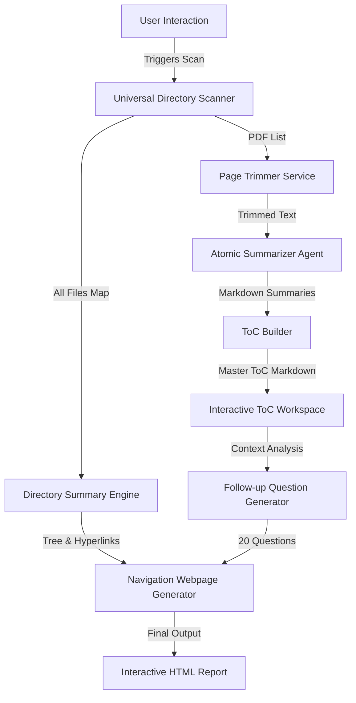

# Technical Specification: Automated PDF Discovery & Agentic Intelligence System

## 1. Executive Summary

### 1.1 Application Overview
This document defines the technical architecture and functional requirements for an **Automated PDF Discovery & Agentic Intelligence System**. This system is designed to act as an autonomous research assistant that lives within a file ecosystem. Its primary function is to recursively scan directory structures to identify PDF documents and **all other file types**, creating a comprehensive **Directory Inventory**. It intelligently processes PDF files by trimming irrelevant metadata, generating high-level summaries for each document, and synthesizing these findings into a master **Table of Contents (ToC)**.

Beyond simple summarization, the system transforms the ToC into an active workspace where users can deploy specialized AI Agents to perform complex reasoning. Crucially, the system generates a **Interactive Navigation Webpage** that provides a hyperlinked view of the entire directory structure, ending with **20 AI-generated follow-up questions** to guide further research.

### 1.2 Core Objectives
*   **Holistic Directory Inventory**: Recursively scan directories to map *all* files (with extensions), not just PDFs, creating a structured Markdown summary of the entire workspace.
*   **Interactive Navigation**: Generate a webpage (HTML/Streamlit view) displaying the file directory where every filename is a clickable hyperlink that opens the file locally.
*   **Automated Discovery & Trimming**: Locate PDF assets, automatically removing the first page (cover sheets) to optimize context windows.
*   **Atomic Summarization**: Generate a concise Markdown summary for every individual PDF found.
*   **Holistic Synthesis (ToC)**: Aggregate all summaries into a structured "Table of Contents".
*   **Proactive Research Assistance**: Automatically generate **20 relevant follow-up questions** based on the analyzed content and directory structure.
*   **Agentic Activation**: Enable users to run advanced agents against the consolidated ToC.

---

## 2. System Architecture

### 2.1 Tech Stack Components
The solution utilizes a modern Python-based stack, optimized for stateless deployment on cloud container services.

*   **User Interface**: **Streamlit**. Provides a reactive, data-driven web interface for file browsing, progress tracking, and agent interaction.
*   **Core Logic**: Python 3.10+.
    *   **File System Operations**: `os` and `pathlib` for robust directory traversal and tree generation.
    *   **PDF Manipulation**: `pypdf` (lightweight, fast) for page extraction and text decoding.
*   **AI Orchestration**:
    *   **LLM Gateway**: A unified controller interacting with **OpenAI** (GPT-4o-mini, GPT-4o) and **Google Gemini** (Gemini 2.5 Flash, 1.5 Pro).
    *   **Agent Configuration**: `agents.yaml` parsing to dynamically load agent personalities.
*   **Deployment**: **Hugging Face Spaces**.

### 2.2 Data Flow Pipeline


---

## 3. Module Specifications

### 3.1 Module 1: Universal Directory Scanner & Summary Engine
This module is responsible for mapping the entire file ecosystem, not just PDFs.

#### 3.1.1 Recursive Inventory
*   **Input**: Root directory path.
*   **Operation**: Recursively walk the directory tree to identify **every file**.
*   **Data Structure**: Capture `Filename`, `Extension`, `Relative Path`, and `Absolute Path`.

#### 3.1.2 Directory Summary Generation (Markdown)
*   **Output**: A Markdown artifact (`Directory_Summary.md`) containing:
    1.  **Tree View**: A visual ASCII-style tree representation of the folders and subfolders.
        ```text
        ├── data/
        │   ├── study_A/
        │   │   ├── report.pdf
        │   │   └── data.csv
        │   └── study_B/
        ```
    2.  **Organized List**: A flat list reorganized by file name and path.
        *   **Format**: `* [Filename.ext](Path) - Type: [Extension]`

### 3.2 Module 2: Interactive Navigation Webpage
This module transforms the raw inventory into a user-friendly interface.

#### 3.2.1 Webpage Construction
*   **Platform**: Generated as an HTML page served via Streamlit (using `st.html` or components).
*   **Features**:
    *   **Hyperlinked Filenames**: Every file listed in the summary is a clickable link.
    *   **Action**: Clicking a link attempts to open the file in the user's local browser or default system application (via `file://` protocol or Streamlit static serving, depending on deployment context. Note: In cloud spaces, this will trigger a "Download" or "View in Browser" action).
*   **Content Integration**: Displays the "Tree View" and "Organized List" from Module 1 in a clean, readable CSS-styled layout.

### 3.3 Module 3: Intelligent PDF Processing (Trimming & Summarization)
Standard PDF processing pipeline (Retained from original spec).

#### 3.3.1 Trimming Rules
*   **Constraint**: Remove the **first page** of each PDF.
*   **Logic**: If page count > 1, discard Page 0. Keep Page 1-End.

#### 3.3.2 Atomic Summarization
*   **Process**: Trimmed text -> LLM (Gemini-Flash/GPT-4o-mini).
*   **Output**: Individual Markdown summary files.

### 3.4 Module 4: Table of Contents (ToC) Synthesis
*   **Aggregation**: Compile all individual summaries into `ToC_Master.md`.
*   **Structure**: Group summaries by subdirectory or topic.

### 3.5 Module 5: Follow-Up Intelligence Generator
A new module to drive deep engagement.

#### 3.5.1 Question Generation Logic
*   **Trigger**: executes automatically after the Directory Summary and ToC are generated.
*   **Input**:
    1.  The `Directory_Summary.md` (Structure).
    2.  The `ToC_Master.md` (Content summaries).
*   **Prompt**: "Review the provided file structure and document summaries. Identify key themes, missing data points, and potential areas for deeper investigation. Generate **20 distinct, high-value follow-up questions** that a researcher should ask about this dataset."
*   **Output**: A Section titled "## 20 Follow-Up Research Questions".
*   **Placement**: Appended to the bottom of the **Interactive Navigation Webpage** and the **ToC Document**.

### 3.6 Module 6: Agentic Execution Workspace
(Retained functionality)
*   Users can select specific agents from `agents.yaml` to answer the generated questions or explore the ToC further.

---

## 4. User Interface Design (Streamlit)

### 4.1 Layout Strategy
*   **Header**: "Project Cortex: Knowledge Navigator".
*   **Tab 1: Directory Map & Navigation (NEW)**
    *   **Visual Tree**: The ASCII tree view of the workspace.
    *   **Hyperlink List**: search-able, clickable table/list of all files.
    *   **Follow-Up Questions**: The list of 20 questions moves to the bottom of this page.
*   **Tab 2: PDF Processor**
    *   Controls for scanning, trimming, and summarizing PDFs.
    *   Progress bars for long-running batch jobs.
*   **Tab 3: Knowledge Base (ToC)**
    *   The compiled summaries of content.
*   **Tab 4: Agent Workbench**
    *   Tools to run `agents.yaml` against the findings.

---

## 5. Security & Configuration Standards

*   **API Key Management**: `OPENAI_API_KEY`, `GEMINI_API_KEY` via environment or UI input.
*   **File Access**: The system requires read permissions for the target directory.

---

## 6. Functional Scenarios

### 6.1 Scenario: The "Deep Dive"
1.  User points system to a folder `Legacy_Medical_Data/`.
2.  System scans and builds the **Directory Summary**.
3.  System trims and indexes 200 PDFs.
4.  **Webpage Generated**: User sees a clickable map of the folder.
5.  **AI Insight**: At the bottom, the system asks: "1. Why does subfolder '2019_Reports' contain only .csv files but no PDF summaries?"
6.  User clicks the link to `2019_Reports/` summary to investigate, then uses an Agent to analyze the CSV headers.

---

*(End of Specification)*
